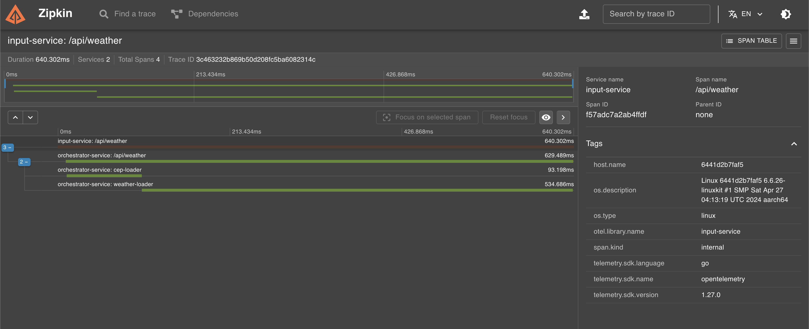

# Desafio Prático - Open Telemetry

Bem-vindo ao Desafio Prático de Open Telemetry da Pós-Graduação Go Expert! Este projeto consiste na implementação de um sistema em Go que recebe um CEP, identifica a cidade e retorna o clima atual (temperatura em graus celsius, fahrenheit e kelvin) juntamente com a cidade. O sistema foi implementado usando Tracing Distribuido com OpenTelemetry e Zipkin.

## Pré-requisitos

Antes de começar, certifique-se de ter instalado os seguintes requisitos:

- [Go SDK](https://golang.org/dl/): Linguagem de programação Go.
- [Docker](https://docs.docker.com/get-docker/): Plataforma de conteinerização.
- [Weather API Key](https://www.weatherapi.com/): Uma chave gratuita da Weather API.

## Executando o Projeto

1. Clone este repositório em sua máquina local:

   ```bash
   git clone https://github.com/allanmaral/go-expert-otel-challenge.git
   ```

1. Navegue até o diretório do projeto:

   ```bash
   cd go-expert-otel-challenge
   ```

1. Duplique o arquivo `.env.example`, renomeie para `.env` e preencha o valor `WEATHER_APIKEY` com a sua chave da [Weather API](https://www.weatherapi.com/):

   ```env
   ORCHESTRATOR_URL=http://localhost:8181
   WEATHER_APIKEY=<WEATHER_API_SECRET_KEY>
   ```

1. Execute o seguinte comando para subir a API usando o docker compose:

   ```bash
   docker compose up -d
   ```

## Acesso aos Serviços

Após subir o serviço, você poderá acessar a API no endereço [http://localhost:8080/api/weather](http://localhost:8080/api/weather). A documentação das rotas do sistema HTTP está disponível no arquivo `./api/api.http`.

### Zipkin

Para visualizar os tracing do sistema, abra a interface do Zipkin no endereço: [http://localhost:9411/zipkin/](http://localhost:9411/zipkin/).



